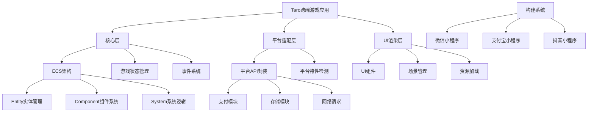

# Taro跨端游戏架构方案设计

## 1. 架构概述

本架构方案基于Taro框架，实现了一套支持微信/支付宝/抖音小程序的跨端游戏架构。采用ECS(Entity-Component-System)架构将游戏核心逻辑与UI渲染分离，实现高效的游戏状态管理和渲染。同时，针对不同平台的支付API，封装了统一的支付接口，确保代码在不同平台上的一致性。

## 2. 技术架构图



## 3. 关键模块清单

### 3.1 核心层

#### 3.1.1 ECS架构
- **Entity管理器**：负责游戏实体的创建、查询和销毁
- **Component系统**：定义游戏对象的各种属性和状态
- **System系统**：实现游戏逻辑，处理实体和组件

#### 3.1.2 游戏状态管理
- 全局状态存储
- 状态更新机制
- 状态同步策略

#### 3.1.3 事件系统
- 事件总线
- 事件分发机制
- 跨模块通信

### 3.2 平台适配层

#### 3.2.1 统一支付接口
- 微信支付适配器
- 支付宝支付适配器
- 抖音支付适配器

#### 3.2.2 存储模块
- 本地存储封装
- 云存储接口

#### 3.2.3 网络请求模块
- HTTP请求封装
- WebSocket封装

### 3.3 UI渲染层

#### 3.3.1 UI组件库
- 游戏通用组件
- 平台特定组件

#### 3.3.2 场景管理
- 场景切换
- 场景预加载

#### 3.3.3 资源加载
- 图片资源管理
- 音频资源管理
- 资源预加载策略

## 4. 实现细节

### 4.1 ECS架构实现

ECS架构将游戏对象分解为实体(Entity)、组件(Component)和系统(System)三部分：
- **Entity**：仅作为组件的容器，没有自己的行为
- **Component**：包含数据但不包含行为
- **System**：包含行为但不包含数据，处理拥有特定组件的实体

这种分离使得游戏逻辑更加模块化，便于扩展和维护。

### 4.2 统一支付接口设计

```typescript
// 支付参数接口
interface PaymentParams {
  outTradeNo: string;  // 商户订单号
  totalFee: number;    // 支付金额（分）
  body: string;        // 商品描述
  [key: string]: any;  // 其他平台特定参数
}

// 支付结果接口
interface PaymentResult {
  success: boolean;     // 支付是否成功
  errMsg?: string;      // 错误信息
  platformResult?: any; // 平台原始返回结果
}

// 统一支付接口
interface UnifiedPayment {
  requestPayment(params: PaymentParams): Promise<PaymentResult>;
}

// 微信支付适配器
class WechatPaymentAdapter implements UnifiedPayment {
  async requestPayment(params: PaymentParams): Promise<PaymentResult> {
    try {
      // 转换为微信支付所需参数
      const wxParams = {
        timeStamp: '',
        nonceStr: '',
        package: '',
        signType: 'MD5',
        paySign: '',
        // 从后端获取的支付参数
        ...params
      };
      
      const res = await wx.requestPayment(wxParams);
      return {
        success: true,
        platformResult: res
      };
    } catch (error) {
      return {
        success: false,
        errMsg: error.errMsg || '支付失败',
        platformResult: error
      };
    }
  }
}

// 支付宝支付适配器
class AlipayPaymentAdapter implements UnifiedPayment {
  async requestPayment(params: PaymentParams): Promise<PaymentResult> {
    try {
      // 转换为支付宝支付所需参数
      const aliParams = {
        tradeNO: params.outTradeNo,
        // 从后端获取的支付参数
        ...params
      };
      
      const res = await my.requestPayment(aliParams);
      return {
        success: true,
        platformResult: res
      };
    } catch (error) {
      return {
        success: false,
        errMsg: error.errMsg || '支付失败',
        platformResult: error
      };
    }
  }
}

// 抖音支付适配器
class TTPaymentAdapter implements UnifiedPayment {
  async requestPayment(params: PaymentParams): Promise<PaymentResult> {
    try {
      // 转换为抖音支付所需参数
      const ttParams = {
        orderInfo: {
          order_id: params.outTradeNo,
          order_amount: params.totalFee
        },
        // 从后端获取的支付参数
        ...params
      };
      
      const res = await tt.requestPayment(ttParams);
      return {
        success: true,
        platformResult: res
      };
    } catch (error) {
      return {
        success: false,
        errMsg: error.errMsg || '支付失败',
        platformResult: error
      };
    }
  }
}

// 支付工厂，根据当前环境创建对应的支付适配器
class PaymentFactory {
  static createPayment(): UnifiedPayment {
    const env = process.env.TARO_ENV;
    
    switch (env) {
      case 'weapp':
        return new WechatPaymentAdapter();
      case 'alipay':
        return new AlipayPaymentAdapter();
      case 'tt':
        return new TTPaymentAdapter();
      default:
        throw new Error(`不支持的平台: ${env}`);
    }
  }
}

// 统一支付服务
export class PaymentService {
  private payment: UnifiedPayment;
  
  constructor() {
    this.payment = PaymentFactory.createPayment();
  }
  
  async pay(params: PaymentParams): Promise<PaymentResult> {
    return this.payment.requestPayment(params);
  }
}
```

### 4.3 跨平台开发注意事项

1. **平台差异处理**：使用条件编译处理平台特定代码
   ```typescript
   // 条件编译示例
   if (process.env.TARO_ENV === 'weapp') {
     // 微信平台特定代码
   } else if (process.env.TARO_ENV === 'alipay') {
     // 支付宝平台特定代码
   } else if (process.env.TARO_ENV === 'tt') {
     // 抖音平台特定代码
   }
   ```

2. **UI适配**：确保UI组件在不同平台上的一致性
   - 使用Taro提供的跨平台组件
   - 针对平台差异，提供平台特定的样式覆盖

3. **API兼容性**：封装平台特定API，提供统一接口
   - 支付接口统一封装
   - 存储接口统一封装
   - 网络请求统一封装

## 5. 开发流程

1. **初始化项目结构**
   - 创建ECS架构相关目录
   - 创建平台适配层目录
   - 创建UI组件目录

2. **实现核心ECS架构**
   - 实现Entity管理器
   - 实现Component系统
   - 实现System系统

3. **实现平台适配层**
   - 实现统一支付接口
   - 实现存储模块
   - 实现网络请求模块

4. **实现UI渲染层**
   - 实现基础UI组件
   - 实现场景管理
   - 实现资源加载

5. **测试与优化**
   - 单元测试
   - 跨平台兼容性测试
   - 性能优化

## 6. 总结

本架构方案通过Taro框架实现代码统一生成，支持微信/支付宝/抖音小程序。采用ECS架构将游戏核心逻辑与UI渲染分离，提高了代码的可维护性和扩展性。同时，通过封装统一的支付接口，解决了不同平台支付API的兼容性问题。该架构方案具有以下优势：

1. **跨平台兼容**：一套代码，多端运行
2. **高度模块化**：ECS架构使各模块职责清晰
3. **易于扩展**：可以方便地添加新的组件和系统
4. **性能优化**：通过ECS架构提高游戏性能
5. **开发效率**：统一的API封装减少平台适配工作

通过本架构方案，可以大幅提高跨端小游戏的开发效率和代码质量，为用户提供一致的游戏体验。